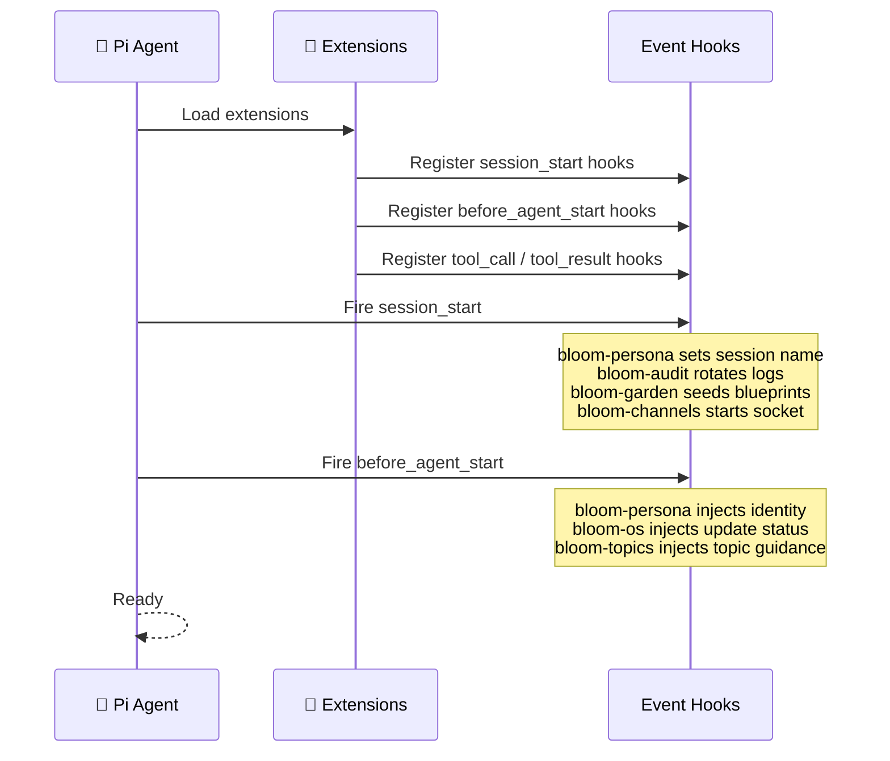
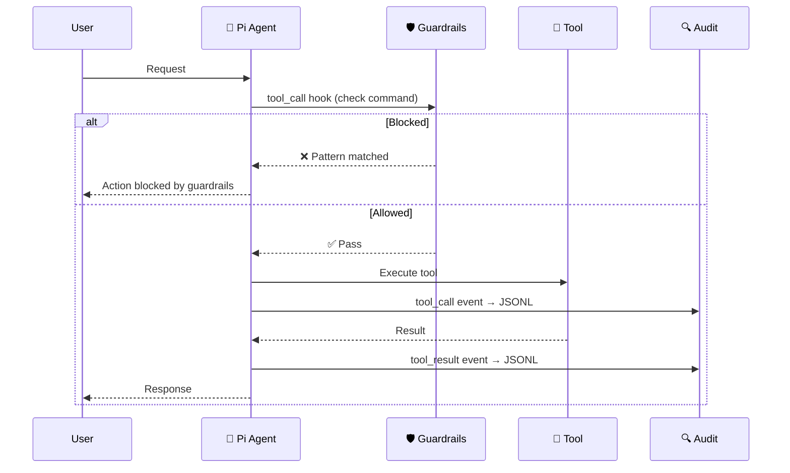
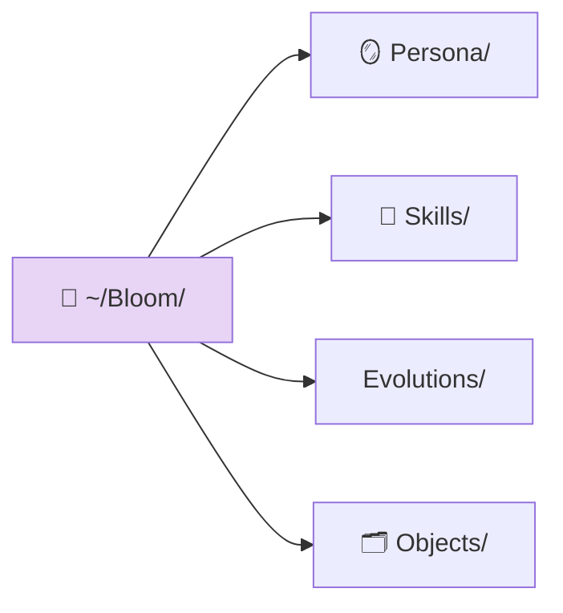

# AGENTS.md

> 📖 [Emoji Legend](docs/LEGEND.md)

## 🌱 Bloom — Pi-Native OS Platform

Bloom is a Pi package that turns a Fedora bootc machine into a personal AI companion host. Pi IS the product; Bloom teaches Pi about its OS.

## 🌱 Extensibility Hierarchy

Bloom extends Pi through three mechanisms, lightest first: **Skill → Extension → Service**.

| Layer | What | When | Created By |
|-------|------|------|------------|
| **Skill** | Markdown instructions (SKILL.md) | Pi needs knowledge or a procedure | Pi or developer |
| **Extension** | In-process TypeScript | Pi needs commands, tools, or event hooks | Developer (PR required) |
| **Service** | Container (Podman Quadlet) | Standalone workload needing isolation | Pi or developer |

Always prefer the lightest option. See `docs/service-architecture.md` for details.

For reproducible releases and artifact trust rules, see `docs/supply-chain.md`.
For multi-device code contribution and PR flow, see `docs/fleet-pr-workflow.md`, `docs/fleet-bootstrap-checklist.md`, and `docs/fleet-pr-workflow-plan.md`.

## 🧩 Extensions





### 🪞 bloom-persona

Identity injection, safety guardrails, and compaction context.

**Hooks:**
- `session_start` — Set session name to "Bloom"
- `before_agent_start` — Inject 4-layer persona (SOUL/BODY/FACULTY/SKILL) + restored compaction context into system prompt
- `tool_call` — Check bash commands against guardrails, block if pattern matches
- `session_before_compact` — Save context (active topic, pending channels, update status) to `~/.pi/bloom-context.json`

### 🔍 bloom-audit

Tool-call audit trail with 30-day retention.

**Tools:** `audit_review`
**Hooks:**
- `session_start` — Rotate audit logs, ensure audit directory
- `tool_call` — Append tool call event to daily JSONL
- `tool_result` — Append tool result event to daily JSONL

### 💻 bloom-os

OS management: bootc lifecycle, containers, systemd, health, updates.

**Tools:**
- Bootc: `bootc` (actions: status, check, download, apply, rollback)
- Containers: `container` (actions: status, logs, deploy)
- System: `systemd_control`, `system_health`
- Updates: `update_status`, `schedule_reboot`

**Hooks:**
- `before_agent_start` — Inject OS update availability into system prompt

### 🔀 bloom-repo

Repository management: configure, sync, submit PRs, check status.

**Tools:** `bloom_repo` (actions: configure, status, sync), `bloom_repo_submit_pr`

### 📦 bloom-services

Service lifecycle: scaffold, install, test, and declarative manifest management.

**Tools:** `service_scaffold`, `service_install`, `service_test`, `service_pair`, `manifest_show`, `manifest_sync`, `manifest_set_service`, `manifest_apply`
**Hooks:**
- `session_start` — Set UI status, check manifest drift, display status widget

### 🗂️ bloom-objects

Flat-file object store with YAML frontmatter + Markdown in `~/Bloom/Objects/`.

**Tools:** `memory_create`, `memory_read`, `memory_search`, `memory_link`, `memory_list`

### 🌿 bloom-garden

Bloom directory management, blueprint seeding, skill creation, persona evolution.

**Tools:** `garden_status`, `skill_create`, `skill_list`, `persona_evolve`
**Commands:** `/bloom` (init | status | update-blueprints)
**Hooks:**
- `session_start` — Ensure Bloom directory structure, seed blueprints (hash-based change detection)
- `resources_discover` — Return skill paths from `~/Bloom/Skills/`

### 📡 bloom-channels

Channel bridge Unix socket server at `$XDG_RUNTIME_DIR/bloom/channels.sock`. JSON-newline protocol with rate limiting and heartbeat.

**Commands:** `/wa` (send message to WhatsApp channel), `/signal` (send message to Signal channel)
**Hooks:**
- `session_start` — Create Unix socket server, load channel tokens
- `agent_end` — Extract response, send back to channel socket by message ID
- `session_shutdown` — Close socket server, cleanup

### 🗂️ bloom-topics

Conversation topic management and session organization.

**Commands:** `/topic` (new | close | list | switch)
**Hooks:**
- `session_start` — Store last context
- `before_agent_start` — Inject topic guidance into system prompt
- `session_start` — Initialize topic state

### 🖥️ bloom-display

AI agent computer use: screenshots, input injection, accessibility tree, and window management on the headless Xvfb display.

**Tools:** `display` (actions: screenshot, click, type, key, move, scroll, ui_tree, windows, launch, focus)

## 🧩 All Registered Tools (27)

Quick reference of every tool name available to Pi:

| Tool | Extension | Purpose |
|------|-----------|---------|
| `audit_review` | bloom-audit | Inspect recent audited tool activity |
| `bootc` | bloom-os | Bootc lifecycle (actions: status, check, download, apply, rollback) |
| `container` | bloom-os | Container management (actions: status, logs, deploy) |
| `systemd_control` | bloom-os | Start/stop/restart/status a service |
| `system_health` | bloom-os | Comprehensive health overview |
| `update_status` | bloom-os | Check if OS update is available |
| `schedule_reboot` | bloom-os | Schedule a delayed reboot |
| `bloom_repo` | bloom-repo | Repository management (actions: configure, status, sync) |
| `bloom_repo_submit_pr` | bloom-repo | Create PR from local changes |
| `service_scaffold` | bloom-services | Generate service package skeleton |
| `service_install` | bloom-services | Install service from bundled local package |
| `service_test` | bloom-services | Smoke-test installed service units |
| `service_pair` | bloom-services | Get QR code for pairing WhatsApp or Signal |
| `manifest_show` | bloom-services | Display service manifest |
| `manifest_sync` | bloom-services | Reconcile manifest with running state |
| `manifest_set_service` | bloom-services | Declare service in manifest |
| `manifest_apply` | bloom-services | Apply desired state |
| `memory_create` | bloom-objects | Create new object in ~/Bloom/Objects/ |
| `memory_read` | bloom-objects | Read object by type/slug |
| `memory_search` | bloom-objects | Search objects by pattern |
| `memory_link` | bloom-objects | Add bidirectional links between objects |
| `memory_list` | bloom-objects | List objects (filter by type, frontmatter) |
| `garden_status` | bloom-garden | Show Bloom directory, file counts, blueprint state |
| `skill_create` | bloom-garden | Create new SKILL.md in ~/Bloom/Skills/ |
| `skill_list` | bloom-garden | List all skills in ~/Bloom/Skills/ |
| `persona_evolve` | bloom-garden | Propose persona layer change |
| `display` | bloom-display | AI computer use: screenshots, input, accessibility tree, window management |

## 📜 Skills

| Skill | Purpose |
|-------|---------|
| `first-boot` | One-time system setup (LLM provider, GitHub auth, repo, services, sync) |
| `os-operations` | System health inspection and remediation (bootc, containers, systemd) |
| `object-store` | CRUD operations for the memory store |
| `service-management` | Install, manage, and discover bundled service packages |
| `self-evolution` | Structured system change workflow |
| `recovery` | Troubleshooting playbooks (WhatsApp, OS updates, dufs, disk, containers) |

## 📦 Services

Modular capabilities managed as container services.
Canonical metadata for automation lives in `services/catalog.yaml`.

| Service | Category | Port | Type |
|---------|----------|------|------|
| `bloom-llm` | ai | 8080 | Podman Quadlet |
| `bloom-stt` | ai | 8081 | Podman Quadlet |
| `bloom-dufs` | sync | 5000 | Podman Quadlet |
| `bloom-whatsapp` | communication | — | Podman Quadlet |
| `bloom-signal` | communication | 18802 | Podman Quadlet |
| `netbird` | networking | — | System RPM service |

## 🪞 Persona

OpenPersona 4-layer identity in `persona/`, seeded to `~/Bloom/Persona/` on first boot:
- `SOUL.md` — Identity, values, voice, boundaries
- `BODY.md` — Channel adaptation, presence behavior
- `FACULTY.md` — Reasoning patterns, decision frameworks
- `SKILL.md` — Current capabilities, tool preferences

### 🌿 Bloom Directory Structure



## 📖 Shared Library

See `ARCHITECTURE.md` for structural rules and enforcement checklist.

`lib/` — pure logic organized by capability:

| File | Key Exports |
|------|-------------|
| `shared.ts` | `createLogger`, `truncate`, `errorResult`, `requireConfirmation`, `nowIso`, `guardBloom` |
| `frontmatter.ts` | `parseFrontmatter`, `stringifyFrontmatter`, `yaml` |
| `filesystem.ts` | `safePath`, `getBloomDir` |
| `exec.ts` | `run` (command execution) |
| `repo.ts` | `getRemoteUrl`, `inferRepoUrl` |
| `audit.ts` | `dayStamp`, `sanitize`, `summarizeInput` |
| `services.ts` | `loadManifest`, `saveManifest`, `loadServiceCatalog`, `installServicePackage`, `buildLocalImage`, `detectRunningServices`, `validateServiceName`, `validatePinnedImage` |

## 🚀 Install

```bash
pi install /path/to/bloom
```

Or for development (loads all extensions from the `extensions/` directory):
```bash
pi install ./
```

## 📖 Setup & Deployment Docs

- OS build/deploy/install: `docs/quick_deploy.md`
- First-boot setup flow: `docs/pibloom-setup.md`
- Fleet PR bootstrap: `docs/fleet-bootstrap-checklist.md`
- Channel protocol: `docs/channel-protocol.md`
- Service architecture: `docs/service-architecture.md`
- Supply chain trust: `docs/supply-chain.md`

## 🔗 Related

- [Emoji Legend](docs/LEGEND.md) — Notation reference
- [Service Architecture](docs/service-architecture.md) — Extensibility hierarchy details
